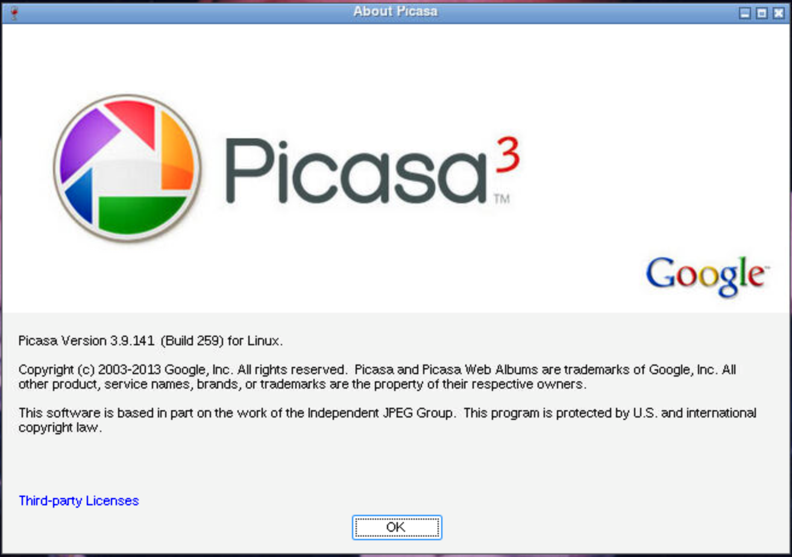

<h1 align="center">
  <br>
  Picasa, in your browser
</h1>

<p align="center">
  <em>A ready-to-run, containerized copy of Google Picasa 3.9 — nothing installed on the computer itself.</em>
</p>

[**Picasa**](https://en.wikipedia.org/wiki/Picasa) was Google's desktop photo
organizer: fast local browsing, albums, face recognition and non-destructive
edits, all working directly on ordinary folders of files. Google discontinued it
in 2016 in favour of the web-based Google Photos, and a lot of people never found
a replacement they liked as much.

This is Picasa 3.9 — the final release — packaged to run in a container and open
in your **web browser**. It works the same on **macOS and Linux**, from a **local
folder or an external drive**.

Picasa runs inside the container (via Wine) and its screen is streamed to your
browser. Your **pictures and your Picasa catalog live in folders you choose**, so
your albums, edits and face tags stay with your photos.

<p align="center">
  
</p>

<p align="center">
  <sub>Picasa 3.9.141 (build 259) running under Wine in the container, viewed in a
  browser. The window frame is Wine's.</sub>
</p>

---

## Requirements

- **macOS or Linux**, and a web browser.
- **Docker or Podman**, installed and running. If you don't have either, the app
  offers to install one for you — or run it yourself:

  ```bash
  ./install-engine.sh
  ```

  It asks which engine you want, shows every command before running it, and
  installs nothing without your say-so. On macOS it uses Homebrew (Colima,
  Docker Desktop or Podman); on Linux it uses your package manager and
  recommends Podman, which is rootless and works without a re-login.

That's all — no Wine, no Picasa installer, no other setup on the host.

> **On Windows:** Picasa 3.9 is itself a Windows application, so you don't need
> any of this — just install Picasa directly, which is simpler and faster. If you
> do want the container version for consistency across machines, run
> `./install-engine.sh` inside **WSL2** and it will tell you what to set up.

---

## Quick start

Open a terminal in this folder and run:

```bash
./setup.sh     # asks where your pictures are and where to keep the database
./run.sh       # starts Picasa, then prints a link
```

When it says **`Picasa is ready -> http://localhost:5800`**, open that address in
your browser.

To stop it:

```bash
./stop.sh
```

> `run.sh` will run `setup.sh` automatically the first time, so you can also just
> run `./run.sh`.

---

## First launch

- Picasa shows a one-time **"Usage Statistics"** prompt — click either button.
- To load your photos: **File ▸ Add Folder to Picasa**, then open drive **`P:\`**
  — that is the pictures folder you chose during setup. Add the subfolders you
  want Picasa to watch.

---

## Where your data is stored

You choose two locations during setup:

| You choose | What goes there | Notes |
|------------|-----------------|-------|
| **Pictures folder** | Your photos & videos, plus per-photo edits/crops/ratings and face boxes (in hidden `.picasa.ini` files) | Read + write. Appears in Picasa as drive `P:\`. |
| **Database folder** | Picasa's index, thumbnails, **albums**, and **face names** (`Google/Picasa2` and `Google/Picasa2Albums`) | This is your catalog. Keep it to preserve your organizing work. |

Everything Picasa creates to organize your pictures lives in those two folders, so
it persists between sessions and travels with them.

The only thing kept per-computer is Picasa's internal "Windows environment"
(needed by Wine); it is recreated automatically and needs no attention.

---

## Using it from an external drive / moving between computers

Put this whole folder on the drive (ideally alongside your pictures and database
folders). Then on any computer:

```bash
./run.sh
```

If the drive mounts at a different path on the new computer, the app **finds your
pictures and database automatically**. If it can't (for example they're on a
different drive), it searches for your Picasa database and, failing that, simply
asks you again. You can also re-point things any time:

```bash
./run.sh --reconfigure      # or: ./setup.sh
```

If the folder includes `picasa-image.tar`, the app works **fully offline** — it
loads that bundled image on first run, so no download or login is required. If
that file is ever **missing or damaged**, the app automatically downloads the
image from its public registry and **rebuilds `picasa-image.tar`**, so offline use
is restored for next time.

---

## Performance

Picasa is a 32-bit application.

- **Linux (Intel/AMD, amd64):** full native speed.
- **macOS on Intel:** also native — `run.sh` removes an emulation shim the Docker
  virtual machine installs for 32-bit programs (see **macOS notes** below), so
  Picasa runs at full speed.
- **macOS on Apple Silicon (M-series):** the whole app image is Intel code and is
  emulated by the Docker VM, so heavy tasks — building thumbnails, indexing a large
  library, face detection — run noticeably slower (the window itself stays
  responsive).

For a very large library, a Linux/amd64 or Intel Mac gives the best experience; the
same folder works everywhere.

---

## macOS notes

On macOS, Docker runs inside a lightweight Linux virtual machine (**Colima** or
**Docker Desktop**). `run.sh` automatically handles two macOS-only quirks every time
it starts — you don't need to do anything, but here's what it does and why:

1. **Full-speed 32-bit (no black screen).** The VM installs an emulator that
   intercepts 32-bit programs like Picasa and runs them very slowly — often showing
   just a **black screen** in the browser. The VM can actually run 32-bit code
   natively, so `run.sh` removes that emulator on every launch (the VM re-adds it
   whenever it restarts).

2. **Making your drive visible to Docker.** The VM can only open folders that are
   *shared* with it. If this app (and your pictures/database) sit on a drive that
   isn't shared — commonly an **external drive** — Picasa opens to an **empty `P:\`**
   and **can't save its catalog**. `run.sh` detects this before starting and prints
   the exact one-time fix for your setup:
   - **Colima:** `colima start --mount "<your-drive>:w"` (then re-run `./run.sh`).
   - **Docker Desktop:** *Settings ▸ Resources ▸ File sharing* → add the drive →
     *Apply & restart*.

   Colima shares only your home folder by default, so an external drive must be added
   once as above. This sharing setting lives on each Mac, so you repeat it the first
   time you use the app on a new Mac.

---

## Troubleshooting

- **"No container engine found" / "Docker or Podman is required":** the computer
  has neither installed (or Docker isn't running). Run `./install-engine.sh`, or
  say yes when `./run.sh` offers to do it. If you just installed Docker on Linux,
  you must log out and back in before it works without `sudo`.
- **Nothing shows / grey screen:** check the logs —
  `docker logs -f picasa` (or `podman logs -f picasa`). Then check services:
  `docker exec -it picasa supervisorctl -c /etc/supervisor/supervisord.conf status`
  (all should be `RUNNING`).
- **Black screen on macOS:** almost always the 32-bit emulator (see **macOS
  notes**). `run.sh` removes it automatically each launch — if you started the
  container another way, run `./stop.sh && ./run.sh`.
- **Empty `P:\`, or your folder/album settings don't persist (macOS):** your drive
  isn't shared with the Docker VM (see **macOS notes**). Run `./run.sh` and follow
  the one-time fix it prints.
- **"Permission denied" writing to your folders (Linux):** the container runs as
  your user ID by default. If your files are owned by a different user, adjust
  `USER_ID`/`GROUP_ID` in `docker-compose.yml` and run `./stop.sh && ./run.sh`.
- **Window is cut off / want a bigger screen:** edit `DISPLAY_WIDTH` /
  `DISPLAY_HEIGHT` in `picasa.conf`, then `./stop.sh && ./run.sh`. In the browser
  toolbar you can also enable **Settings ▸ Scaling ▸ Local Scaling**.
- **Port 5800 already in use:** change the left number of `"5800:5800"` in
  `docker-compose.yml` (e.g. `"5900:5800"`) and open `http://localhost:5900`.
- **Start over:** stop the app and delete your database folder — your photos are
  untouched; Picasa rebuilds the catalog from them and the `.picasa.ini` files.

---

## What's in this folder

| File | Purpose |
|------|---------|
| `install-engine.sh` | Install Docker or Podman if the computer has neither |
| `setup.sh` | Configure the pictures & database locations |
| `run.sh` | Start Picasa (auto-configures, auto-relocates on a moved drive) |
| `stop.sh` | Stop Picasa |
| `docker-compose.yml` | Container definition |
| `docker-compose.podman.yml` | Podman-only adjustment (used automatically) |
| `picasa-image.tar` | *(optional)* the application image, for offline use |
| `lib.sh` | Shared helper functions used by the scripts |
| `picasa.conf` | *(created by setup)* your saved locations |
| `images/` | Pictures used by this README |
| `LICENSE` | MIT licence for this project's own files |
| `build/` | How the container image is built — only needed if you want to rebuild it |

---

## Where the image comes from

You don't need to build anything. On first run the app obtains the container
image in this order:

1. **`picasa-image.tar`** in this folder, if present and valid → loaded directly,
   so **no internet is needed**.
2. Otherwise it **pulls from the public registry**
   `quay.io/wine_apps/picasa-3.9`, tags it locally as `picasa-app:latest`, and
   then **writes `picasa-image.tar` back into this folder** — so the next run, and
   any other machine you carry this folder to, works offline.

   **No account or `docker login` is needed.** That Quay repository is public and
   pulls anonymously, so step 2 just works on a fresh machine.

The tar is around 725 MB, so it is deliberately **not** stored in git; it is
rebuilt locally as described above. If it ever gets corrupted, delete it and run
`./run.sh` again.

To rebuild the image from source instead — for example to audit it, or to use a
different Picasa installer — see [`build/README.md`](build/README.md). Note that
Picasa itself is proprietary and is **not** included in this repository; building
requires your own copy of the installer.

---

## Licensing and provenance

- **Picasa is proprietary Google software**, discontinued in 2016 and no longer
  distributed or supported by Google. This is an unofficial, unaffiliated
  repackaging for personal use, not endorsed by Google.
- **The Picasa installer is not in this repository** — see
  [`build/README.md`](build/README.md) if you want to build the image yourself.
- **The Picasa name, logo and screenshot** here are Google trademarks/copyright,
  used only to identify and document the software this runs.
- **Wine, Debian, noVNC, x11vnc, Xvfb, openbox and supervisor** are used as
  packaged by Debian, under their own licenses.
- The **packaging** — scripts, compose files, Dockerfile and documentation — is
  this project's own work, released under the **MIT License**
  ([`LICENSE`](LICENSE)).

  To be explicit about what that covers: the MIT licence applies **only to the
  files in this repository**. It grants you no rights whatsoever to Picasa
  itself, to Google's trademarks, or to the contents of the prebuilt container
  image, none of which are this project's to license.

---

## A note on access

There is **no password on the web interface**. Anyone who can reach port 5800 on
the machine running it can control Picasa, and through its file dialogs, the
folders you mounted. That's fine on a computer you're sitting at.

If the machine is on a network you don't fully trust, bind it to loopback only —
change the ports line in `docker-compose.yml` to:

```yaml
      - "127.0.0.1:5800:5800"
```

and reach it over an SSH tunnel instead:
`ssh -L 5800:localhost:5800 you@thatmachine`, then open `http://localhost:5800`.
Don't expose it directly to the internet without a reverse proxy providing
authentication and TLS.
